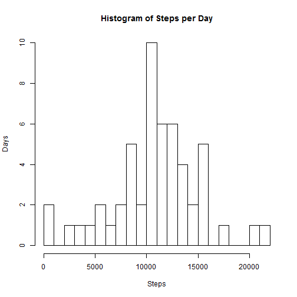
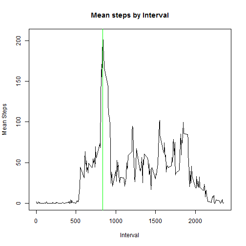
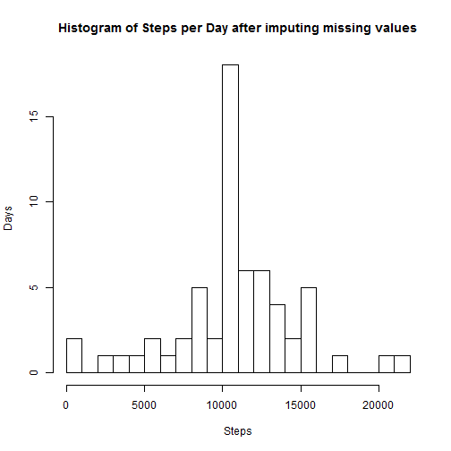
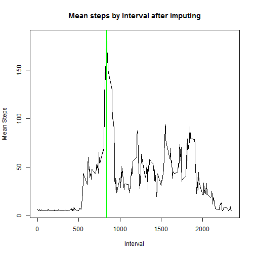
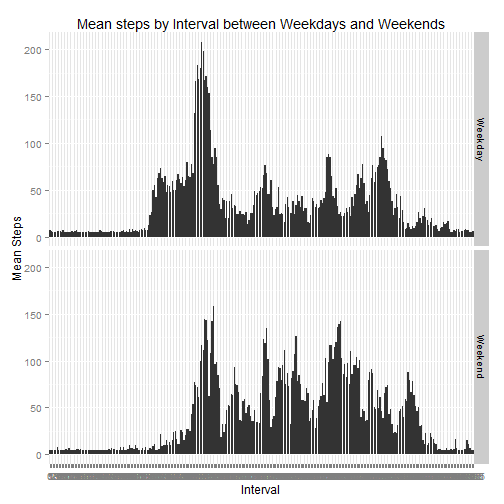

The following report provides some statistical answers to questions in this assessment.
This report makes use of data from a personal activity monitoring device. This device collects data at 5 minute intervals through out the day. The data consists of two months of data from an anonymous individual collected during the months of October and November, 2012 and include the number of steps taken in 5 minute intervals each day.

###Loading & processing the data

```r
activity <- read.csv("activity.csv")
activity$date <- as.Date(activity$date, "%Y-%m-%d")
activity_no_na <- subset(activity, na.rm=TRUE, na.action=na.omit)
```

###Calculating the total number of steps by day

```r
steps_per_day <- aggregate(activity_no_na$steps, 
                           by=list(activity_no_na$date), 
                           FUN=sum)
names(steps_per_day) <- c('Date', 'Steps')
hist(steps_per_day$Steps, 
     breaks = 30,
     main = "Histogram of Steps per Day", 
     xlab = "Steps", 
     ylab = "Days")
```

 

####This is the mean value of steps per day

```r
mean_steps_per_day <- mean(steps_per_day$Steps, na.rm=TRUE)
mean_steps_per_day
```

```
## [1] 10766.19
```

####This is the median value of steps per day

```r
median_steps_per_day <- median(steps_per_day$Steps, na.rm=TRUE)
median_steps_per_day
```

```
## [1] 10765
```

###Average daily activity pattern with max step Interval

```r
mean_by_interval <- aggregate(activity$steps, by=list(activity$interval), FUN=mean, na.rm=TRUE)
names(mean_by_interval) <- c("Interval","Steps")
plot(mean_by_interval$Interval, 
     mean_by_interval$Steps, 
     type = "l",
     main="Mean steps by Interval",
     xlab="Interval",
     ylab="Mean Steps")
max_steps_at_interval <- mean_by_interval[which.max(mean_by_interval$Steps),]
max_steps_at_interval
```

```
##     Interval    Steps
## 104      835 206.1698
```

```r
abline(v=max_steps_at_interval$Interval, col="green")
```

 
####As you can see from the data and diagram above(green line) the 835 minute interval contains the maximum number of steps, in this case 206 steps.

###Number of missing Values in the dataset

```r
activity_with_na <- subset(activity, is.na(activity$steps))
length(activity_with_na$steps)
```

```
## [1] 2304
```

###Strategy to impute missing values by taking overall mean
####Though the strategy to impute missing values could be sophisticated, due to time constraints I am sticking to a basic strategy where I apply the overall mean to the NA values

```r
overall_mean <- mean(mean_by_interval$Steps)
overall_mean
```

```
## [1] 37.3826
```

```r
imputed_activity <- activity
imputed_activity[is.na(imputed_activity)] <- overall_mean
```

###Calculating the total number of steps by day after imputing missing values

```r
imputed_steps_per_day <- aggregate(imputed_activity$steps, 
                           by=list(imputed_activity$date), 
                           FUN=sum)
names(imputed_steps_per_day) <- c('Date', 'Steps')
hist(imputed_steps_per_day$Steps, 
     breaks = 30,
     main = "Histogram of Steps per Day after imputing missing values", 
     xlab = "Steps", 
     ylab = "Days")
```

 

```r
imputed_mean_steps_per_day <- mean(imputed_steps_per_day$Steps, na.rm=TRUE)
imputed_mean_steps_per_day
```

```
## [1] 10766.19
```

```r
imputed_median_steps_per_day <- median(imputed_steps_per_day$Steps, na.rm=TRUE)
imputed_median_steps_per_day
```

```
## [1] 10766.19
```

###Average daily activity pattern with max step Interval after imputing missing values 

```r
imputed_mean_by_interval <- aggregate(imputed_activity$steps, by=list(imputed_activity$interval), FUN=mean, na.rm=TRUE)
names(imputed_mean_by_interval) <- c("Interval","Steps")
plot(imputed_mean_by_interval$Interval, 
     imputed_mean_by_interval$Steps, 
     type = "l",
     main="Mean steps by Interval after imputing",
     xlab="Interval",
     ylab="Mean Steps")
imputed_max_steps_at_interval <- imputed_mean_by_interval[which.max(imputed_mean_by_interval$Steps),]
imputed_max_steps_at_interval
```

```
##     Interval    Steps
## 104      835 184.0338
```

```r
abline(v=imputed_max_steps_at_interval$Interval, col="green")
```

 

####As you can see from the data and graph above, the interval mean values have gone down from 206 to 184 after imputing the missing values with overall mean.

###Activity patterns between Weekdays and Weekends with imputed data

```r
imputed_activity_with_day <- imputed_activity
imputed_activity_with_day$day <- weekdays(as.Date(imputed_activity_with_day$date))
imputed_activity_with_day$daytype <- ifelse(imputed_activity_with_day$day == "Saturday" | imputed_activity_with_day$day == "Sunday", "Weekend" , "Weekday")
library(ggplot2)

imputed_mean_by_daytype_interval <- aggregate(imputed_activity_with_day$steps, by=list(imputed_activity_with_day$daytype, imputed_activity_with_day$interval), FUN=mean)
names(imputed_mean_by_daytype_interval) <- c("Daytype", "Interval", "Steps")

ggplot(imputed_mean_by_daytype_interval, aes(factor(Interval), Steps)) +              
  geom_bar(stat="identity")+
  facet_grid (Daytype ~ .) +
  labs(x="Interval", y="Mean Steps") + 
  labs(title="Mean steps by Interval between Weekdays and Weekends")
```

 

####End of the report
